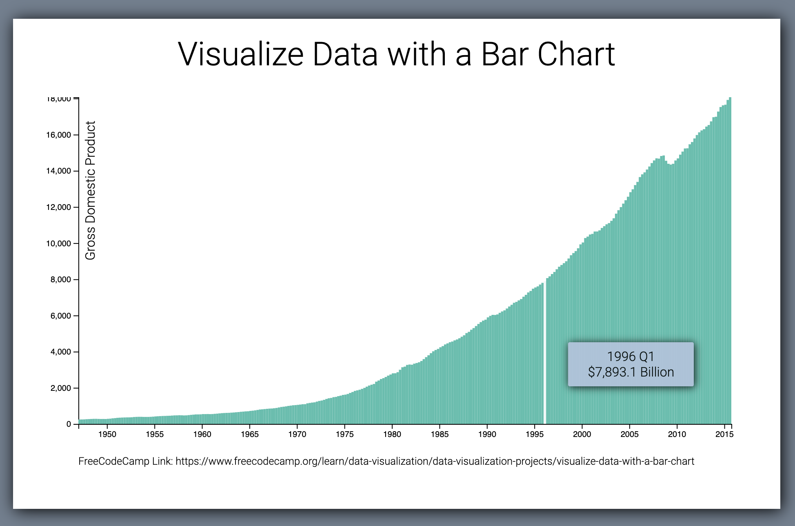

### Chart 1: Visualize Data with a Bar Chart

- Get Gross Domestic Product (GDP) data with api call
- Show GDP data using the bar chat
- Render x-axis and y-axis
- If we hove over an area then will see more information of that area

**Live Demo:** https://codepen.io/sajibcse68/full/oNYVNoB  
.

### Chart 2: Scatterplot Graph using D3.js

- Do the API call and get the Data of different dot
- Plot the Scatter graph using D3.js
- Render x-axis and y-axis
- If we hove over an area then will see more information of the Dot
- Run all the tests and passed 16/16 tests!

**Live Demo:** https://codepen.io/sajibcse68/full/abJrxKe 
.

